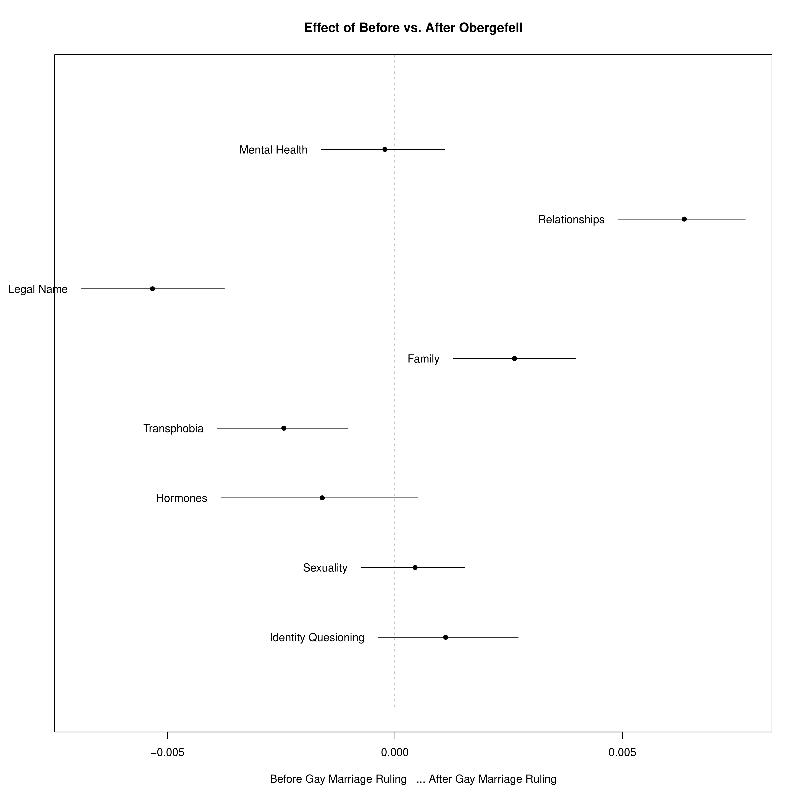

# Key Concerns in the Transgender Community: Before and After Obergefell v. Hodges

The Supreme Court ruling (Obergefell v. Hodges) indicating that the fundamental right to marry is guaranteed to same-sex couples was a pivotal moment for the LGBTQ community and one that changed the discourse around queer topics. While not being explicitly directed towards transgender individuals, the ruling eliminated the mixed-sex requirement for civil marriage, making people’s gender irrelevant to the right to marry and thus making it easier for transgender individuals to marry the person of their choice, irrespective of their sex. Additionally, the Obergefell v. Hodges marriage equality decision further “offer[ed] key support for the propositions that the constitution protects peoples’ ability to define and express their gender identities, to shape their own destinies, and that courts can hold the Constitution to protect this gender autonomy”, further empowering transgender individuals (Cruz, 2015). 

Using a corpus from the r/ asktransgender subreddit including posts from 2009 to 2020, this project aims to examine whether the key concerns of individuals in the transgender community changed after June 26th 2015 (the day the Supreme Court ruling passed) when compared to prior to Obergefell through the use of topic models.

## Data

The corpus was extracted using the Python Reddit API Wrapper (PRAW) and the Python Pushshift.io API Wrapper (PSAW), which allowed to scrape the entirety of the subreddit and transform it into a data frame. The resulting csv file includes 258,634 entries (i.e. unique posts) and 9 features. 

The entries in the data frame range from August 8th, 2009 (the date the sub-reddit was created) until May 6th 2020 (the date the subreddit was last scraped) and are sorted by score in descending order (i.e. starting with the post with the highest score).

## Files Included 

* `asktransgender_scraper.py`: data extraction
* `asktransgender_preprocessing.R`: 
  - data cleaning
  - covariate creation
  - preprocessing
* `analysis_asktransgender.R`:
  - Latent Dirichlet Allocation (LDA)
  - Structural Topic Models (STM)
* `Analysis.pdf`: writeup including the following sections
  - Introduction
  - Corpus Overview
  - Data Cleaning and Covariate Creation
  - Preprocessing
  - Methods- Latent Dirichlet Allocation (LDA) and Structural Topic Models (STM)
  - Latent Dirichlet Allocation (LDA) Results
  - Structural Topic Model (STM) Results
  - References 
* `plots`: plots included in the writeup as part of the analysis 

## Results Summary

When using a Structural Topic Model (STM) including `Gay_Marriage` (whether a post was written before or after June 26th 2015) as a prevalence covariate in order to examine the differences in topic occurrence before and after Obergefell v. Hodges, we can see that the Supreme Court ruling did have an effect on the topics of concern for the transgender community. 

While mental health, changing one’s legal name, transphobia, and hormones were more talked about before the Supreme Court ruling, relationships, family, sexuality, and identity questioning occur more often in posts after Obergefell. This indicates a shift in discourse towards the transgender community and an increase in individuals feeling like they are supported by their families, friends, and significant others. Additionally, in line with the fact that the ruling emphasized that the constitution protects peoples’ ability to express their gender identity, we can see that individuals are now more open to exploring their identity and sexuality online with their peers.

* Please refer to the `Analysis.pdf` file for more detailed results
